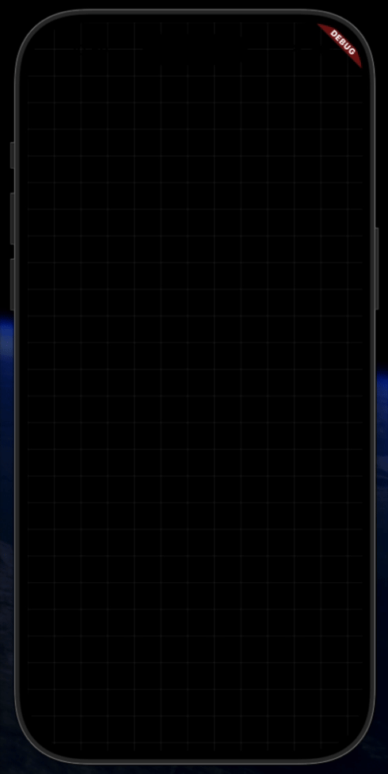

# Flutter Components

A collection of reusable Flutter UI components and widgets that can be easily integrated into your Flutter applications. Each component is ready to use with copy-paste implementation.

## 📦 Components

### 1. [Retro Splash Screen](./retro_spashscreen)

A customizable splash screen widget with retro aesthetic and smooth animations.

**Features:**
- Retro-style splash screen with typewriter effect
- Drawing/animation effects
- Easy to customize colors and timings
- Supports iOS and Android platforms

**Quick Setup:**
Simply copy the `splash_screen.dart` file to your project's `lib/screens/` directory and import it in your `main.dart`.

[📖 View Full Documentation](./retro_spashscreen/README.md)

---

### 2. [Animated Splash Screen](./animated_splashscreen)

An animated splash screen component with smooth fade and scale animations.

**Features:**
- Smooth fade-in and scale animations
- Customizable duration and easing
- Easy to integrate into any Flutter app
- Works on all platforms

**Quick Setup:**
Copy the `splash_Screen.dart` file to your project and use it as your app's home screen.

[📖 View Full Documentation](./animated_splashscreen/README.md)

---

### 3. [Theme Mode Button](./ThemeMode_Button/themebutton.gif)

A theme switcher widget that allows users to toggle between light and dark themes.

![Theme]

**Features:**
- Easy-to-use theme toggle button
- Dark and light mode support
- Customizable styling
- Works with Flutter's built-in theming system

**Quick Setup:**
Copy the theme controller and button files to your project and integrate with your app's theme provider.

[📖 View Full Documentation](./ThemeMode_Button/README.md)

---

## 🚀 Getting Started

Each component is a standalone example that can be used independently:

1. **Clone or download** this repository
2. **Navigate** to the component folder you want to use
3. **Copy** the necessary files to your project
4. **Follow** the component's README for integration steps

## 📋 Requirements

- Flutter SDK: 3.0 or higher
- Dart SDK: 3.0 or higher

## 💡 Tips

- Each component is self-contained and can be used without any external package dependencies
- Feel free to customize and modify components to suit your needs
- Refer to individual component READMEs for detailed customization options

## 📄 License

All components are available under the MIT License. See individual LICENSE files for details.

## 🤝 Contributing

Feel free to contribute improvements, bug fixes, or new components! 

---

**Happy coding! 🎉**
