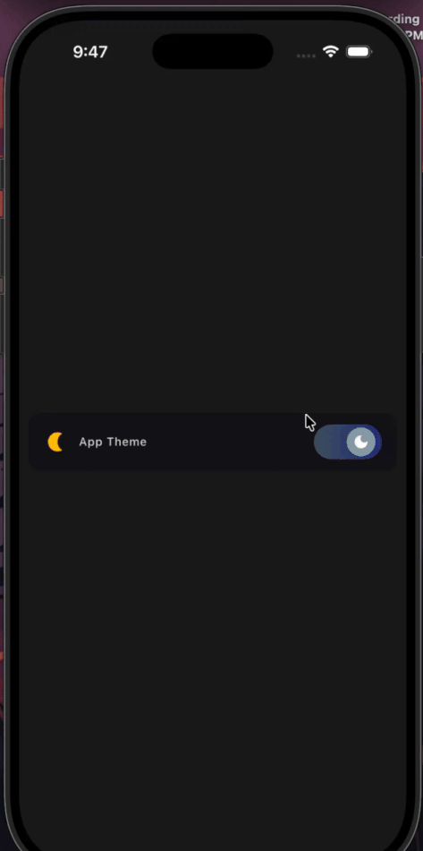

# ThemeSwitcher Component (Flutter)



A lightweight, reusable theme switcher for Flutter apps that uses the default
`setState` mechanism (no GetX required). This repository demonstrates a small
component (`ThemeSwitcher`) and a theme toggle UI (`ThemeButton`) which you can
reuse in any Flutter project by copying a few files.

## Overview

- Replaced GetX-based theme management with plain `setState`.
- Added `ThemeSwitcher` which wraps `MaterialApp` and exposes a `builder` with
  `(BuildContext context, bool isDark, VoidCallback toggle)` so any UI can
  toggle theme state.
- Provided `ThemeButton` (visual toggle) and `ThemeButtonSimple` (stateless
  wrapper) for easy inclusion in your app.

## Files to copy into your project

- `lib/theme_switcher.dart` — The main reusable component that manages theme
  state.
- `lib/theme_button.dart` — The UI widget for the on-screen toggle.
- `lib/Implementation.dart` — Contains `ThemeButtonSimple` (optional helper).
- `lib/app_themes.dart` — Your `ThemeData` definitions (light/dark themes).

If you prefer a smaller surface area, you can omit `Implementation.dart` and
use `ThemeButton` directly in your widget tree.

## Quick setup

1. Copy the files listed above into your project's `lib/` folder.
2. If your project currently depends on `get` (GetX) and you no longer need it,
   remove it from `pubspec.yaml` under `dependencies` and run:

```bash
flutter pub get
```

3. Use `ThemeSwitcher` at the root of your app (example below).

## Example usage

Replace your `main.dart` with something like this (or adapt it into your app):

```dart
import 'package:flutter/material.dart';
import 'app_themes.dart'; // your ThemeData definitions
import 'theme_switcher.dart';
import 'Implementation.dart'; // optional; provides ThemeButtonSimple

void main() {
  WidgetsFlutterBinding.ensureInitialized();
  runApp(const MyApp());
}

class MyApp extends StatelessWidget {
  const MyApp({super.key});

  @override
  Widget build(BuildContext context) {
    return ThemeSwitcher(
      lightTheme: lightThemeData,
      darkTheme: darkThemeData,
      builder: (context, isDark, toggle) {
        return Scaffold(
          body: Center(
            child: ThemeButtonSimple(isDark: isDark, onToggle: toggle),
          ),
        );
      },
    );
  }
}
```

Notes:
- `ThemeSwitcher` creates the `MaterialApp` and manages `themeMode`.
- `builder` receives the current boolean `isDark` and a `toggle` callback.

## Using `ThemeButton` directly

If you want the UI widget but prefer to manage the `isDark` state somewhere
else, you can directly use `ThemeButton` (it accepts `isDark` and `onToggle`).

```dart
ThemeButton(isDark: isDarkValue, onToggle: () { setState(() => isDarkValue = !isDarkValue); })
```

## Testing manually

1. Run the app:

```bash
flutter pub get
flutter run
```

2. Tap the theme toggle to switch between light and dark modes.

## Optional: Widget test (example)

You can add a widget test to verify the toggle updates state. Create
`test/theme_switcher_test.dart` with a simple test that pumps `ThemeSwitcher`
and verifies the UI updates after tapping the toggle. Then run:

```bash
flutter test test/theme_switcher_test.dart
```

## Migration notes (removing GetX)

- If your project included `get` only for theme management, you can safely
  remove the dependency from `pubspec.yaml` and delete any `Get.put` /
  `Get.find` calls.
- If you used GetX for routing or other features, migrate those parts
  separately before removing the package.

## Next steps / Enhancements

- Convert `ThemeSwitcher` to an `InheritedWidget` or `Provider` for global
  access without passing callbacks.
- Publish the component as a small Flutter package if you want to reuse it
  across many projects.

---

If you'd like, I can also:
- Add a ready-to-run widget test file for this repo.
- Convert `ThemeSwitcher` to an `InheritedWidget` or `ChangeNotifier` +
  `Provider` implementation.

Feel free to tell me which of those you'd like next.
# test_workbench

A new Flutter project.

## Getting Started

This project is a starting point for a Flutter application.

A few resources to get you started if this is your first Flutter project:

- [Lab: Write your first Flutter app](https://docs.flutter.dev/get-started/codelab)
- [Cookbook: Useful Flutter samples](https://docs.flutter.dev/cookbook)

For help getting started with Flutter development, view the
[online documentation](https://docs.flutter.dev/), which offers tutorials,
samples, guidance on mobile development, and a full API reference.
