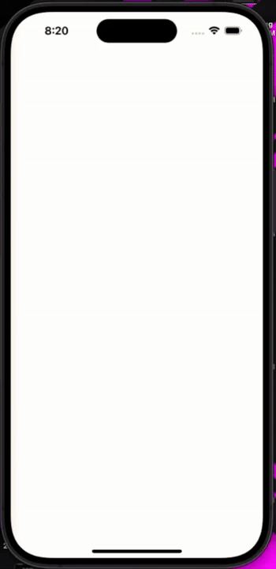

# animated_splashscreen

Lightweight animated splash screen for Flutter apps.

This repository contains a standalone, easy-to-customize `SplashScreen` widget built with Flutter animations. It was created so you (and others) can drop a polished animated splash into any Flutter project.

**Preview**

You can preview the animation using the included animated GIF at `animated_splash.gif` (relative to the repository root). GitHub will render the GIF inline; otherwise download or open it locally.



## Features

- **Simple integration:** Drop the `SplashScreen` widget into your app.
- **Customizable:** Adjust image assets, durations, colors and text inside `lib/splash_Screen.dart`.
- **No external dependencies:** Uses only Flutter's built-in animation APIs.

## Files of interest

- `lib/splash_Screen.dart` — the main animated splash widget (`SplashScreen`).
- `lib/main.dart` — example launcher using the splash.
- `assets/` — images and resources used by the widget (e.g. `assets/logo.png`).
- `animated_splash.gif` — short preview GIF of the animated splash.

## Quick Start

1. Clone the repo and get packages:

```
git clone <your-repo-url>
cd animated_splashscreen
flutter pub get
```

2. Run the example app (simulator or device):

```
flutter run
```

3. To use the widget in your own project, copy `lib/splash_Screen.dart` and the images in `assets/` into your app (or reference this package if you publish it).

Example usage in `main.dart`:

```dart
import 'package:flutter/material.dart';
import 'splash_Screen.dart'; // or the package path if packaged

void main() => runApp(const MyApp());

class MyApp extends StatelessWidget {
	const MyApp({super.key});

	@override
	Widget build(BuildContext context) {
		return const MaterialApp(
			home: SplashScreen(),
		);
	}
}
```

## Customization Tips

- Change the logo: replace `assets/logo.png` and update the image path in `lib/splash_Screen.dart`.
- Adjust animation timings: modify the `AnimationController` `duration` values in `initState()`.
- Modify background color or text: edit the `Scaffold` background and `Text` widget in `build()`.
- Add navigation: replace the `checkForOnboarding()` placeholder with your own routing logic.

## Contributing

If you'd like to improve the component:

- Fork the repo and create a branch for your change.
- Add clear, focused commits and a short description of the change.
- Open a pull request and include screenshots or a short preview video when relevant.

## License

This project does not include a license file. If you intend to publish or share this component, add a `LICENSE` file (for example, MIT) to clarify reuse terms.
